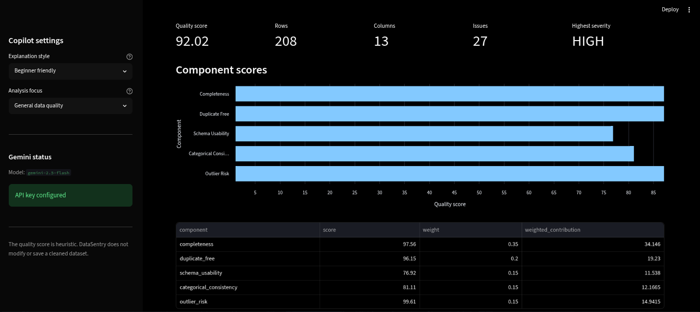
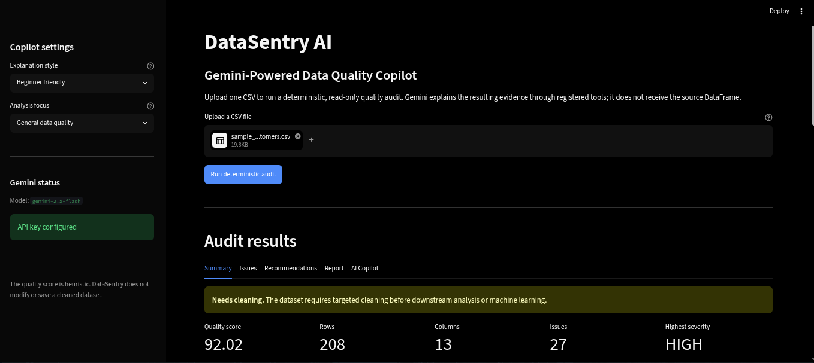
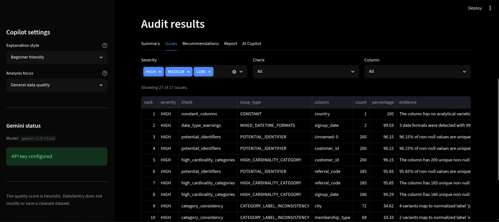
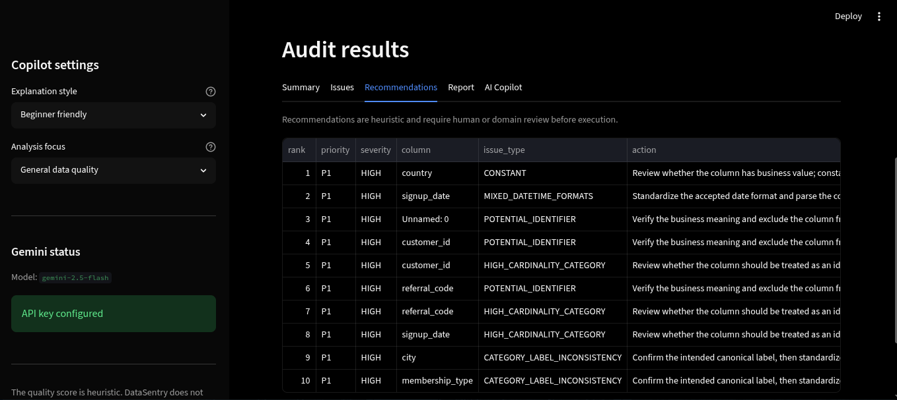
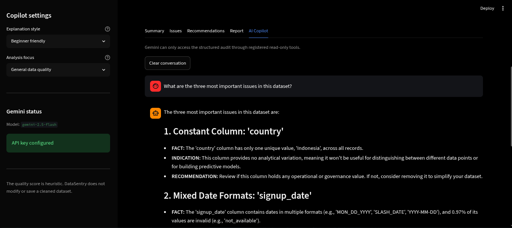

# DataSentry AI — Gemini-Powered Data Quality Copilot

DataSentry AI is an AI-assisted data quality auditing application built with Streamlit, Python, and Google Gemini.

The project combines deterministic data quality analysis with a grounded AI copilot architecture. Instead of allowing the LLM to directly inspect uploaded datasets, DataSentry AI generates a structured audit report and exposes only read-only audit tools to Gemini. This design improves transparency, reduces hallucination risk, and ensures that factual answers remain traceable to deterministic audit results.

---

# Project Overview

DataSentry AI helps analysts, data scientists, and business users quickly assess the quality of CSV datasets before using them for analytics, reporting, machine learning, or AI applications.

The application automatically evaluates dataset quality, identifies common issues, generates recommendations, and provides an AI copilot that can explain audit findings in natural language.

---

# Business Problem

Poor data quality is one of the most common causes of failed analytics and machine learning projects.

Common issues include:

* Missing values
* Duplicate records
* Outliers
* Inconsistent categories
* Invalid data types
* Identifier leakage
* High-cardinality columns
* Poor schema usability

Traditional data quality reviews are often manual, time-consuming, and difficult for non-technical stakeholders to interpret.

DataSentry AI addresses this problem by combining deterministic quality auditing with explainable AI assistance.

---

# Solution Overview

DataSentry AI performs two complementary functions:

1. Deterministic Audit Engine

   * Calculates data quality metrics using Python.
   * Generates a structured audit report.
   * Produces quality scores and readiness assessments.

2. AI Copilot

   * Uses Google Gemini.
   * Accesses audit findings through read-only tools.
   * Explains results, risks, and recommendations.
   * Cannot modify data or fabricate audit results.

This architecture separates factual computation from natural-language explanation.

---

# Main Features

## CSV Validation

* File extension validation
* File size validation
* Empty file detection
* Null-byte detection
* Encoding detection
* Delimiter detection
* Duplicate header validation
* Dataset fingerprinting

## Data Quality Analysis

* Dataset overview
* Missing value analysis
* Duplicate detection
* Constant column detection
* Near-constant column detection
* Potential identifier detection
* High-cardinality category detection
* Numeric outlier detection
* Category consistency analysis
* Data type warning detection

## Quality Scoring

* Weighted quality score
* Readiness assessment
* Severity-aware penalties
* Score band classification

## AI Copilot

* Gemini-powered assistant
* Read-only tool architecture
* Grounded responses
* Tool activity tracking
* Conversation history
* Explanation style controls

## Reporting

* Structured audit report
* JSON report download
* Filtered issue export
* Prioritized recommendations

---

# System Architecture

```text
CSV Upload
↓
src/data_loader.py
↓
Validated DataFrame
↓
src/quality_checks.py
↓
src/quality_score.py
↓
src/report_builder.py
↓
Structured Audit Report
↓
src/tools.py
↓
Read-Only Audit Toolbox
↓
src/gemini_client.py
↓
Gemini Function Calling Loop
↓
app.py
↓
Streamlit Dashboard
```

Core principle:

```text
Python calculates facts.

The audit report becomes the source of truth.

Gemini explains the facts through read-only tools.
```

---

# Gemini Tool Architecture

A major design goal of DataSentry AI is reducing hallucination risk.

Instead of providing the uploaded DataFrame directly to Gemini:

```text
❌ User → Gemini → Answer
```

DataSentry AI uses:

```text
User
↓
Audit Report
↓
Read-Only Tools
↓
Gemini
↓
Answer
```

Benefits:

* Improved factual consistency
* Reduced hallucinations
* Explainable audit results
* Safer AI behavior
* Clear separation between computation and explanation

Available tools:

* get_dataset_overview
* get_quality_summary
* get_missing_value_report
* get_duplicate_report
* get_column_quality_report
* get_priority_issues
* get_ml_readiness_report

All tools are read-only.

---

# Folder Structure

```text
datasentry-ai/
├── app.py
├── README.md
├── requirements.txt
├── .env.example
├── .streamlit/
│   └── config.toml
├── src/
│   ├── config.py
│   ├── data_loader.py
│   ├── quality_checks.py
│   ├── quality_score.py
│   ├── report_builder.py
│   ├── prompts.py
│   ├── tools.py
│   ├── gemini_client.py
│   └── utils.py
├── tests/
├── data/
└── assets/
```

---

# Installation

Clone the repository:

```bash
git clone <repository-url>
cd datasentry-ai
```

Create a virtual environment:

```bash
python -m venv .venv
```

Activate the environment:

```bash
source .venv/bin/activate
```

Install dependencies:

```bash
python -m pip install --upgrade pip
python -m pip install -r requirements.txt
```

---

# Environment Variables

Create a `.env` file:

```env
GEMINI_API_KEY=your_api_key
GEMINI_MODEL=gemini-2.5-flash
GEMINI_TEMPERATURE=0.2
GEMINI_MAX_OUTPUT_TOKENS=2048
GEMINI_MAX_CONVERSATION_MESSAGES=12
GEMINI_MAX_TOOL_ROUNDS=5
GEMINI_REQUEST_TIMEOUT_SECONDS=60
DATASENTRY_DEFAULT_EXPLANATION_STYLE=business-friendly
DATASENTRY_DEFAULT_ANALYSIS_FOCUS=general-data-quality
```

Never commit `.env` files to source control.

---

# How to Run

Launch the Streamlit application:

```bash
streamlit run app.py
```

Default local URL:

```text
http://localhost:8501
```

---

# How to Test

Run the full test suite:

```bash
python -m pytest
```

Additional validation:

```bash
python -m pytest -q
python -m compileall app.py src tests
python -m pip check
git diff --check
```

Latest validation result:

```text
212 passed
No broken requirements found
```

---

# Sample Audit Results

Sample dataset:

```text
data/sample_dirty_customers.csv
```

Expected results:

```text
Quality score       : 92.02
Score band          : READY_WITH_MINOR_REVIEW
Final readiness     : NEEDS_CLEANING

Total issues        : 27

CRITICAL            : 0
HIGH                : 14
MEDIUM              : 7
LOW                 : 6

Duplicate rows      : 8
Duplicate percentage: 3.85%
```

Important:

A high quality score does not override severe data quality issues.

Readiness gates may downgrade the final status.

---

# Screenshots

## Dashboard Overview



## Quality Summary



## Issues Dashboard



## Recommendations Tab



## AI Copilot



---

# Limitations

Current limitations include:

* CSV-focused workflow
* No database connectivity
* No multi-user support
* No authentication system
* No persistent conversation storage
* Heuristic quality scoring
* Gemini API dependency for copilot functionality

---

# Disclaimer

DataSentry AI is a portfolio and educational project.

The quality score is a heuristic indicator and should not be interpreted as a formal certification of dataset quality.

The AI copilot provides explanations and recommendations based on audit results and should not replace professional data governance, risk management, or compliance reviews.

---

# Future Improvements

Potential future enhancements:

* Support for Excel and Parquet files
* Data profiling visualizations
* Automated cleaning suggestions
* Data drift monitoring
* Database integrations
* Multi-user authentication
* Audit history tracking
* Cloud deployment
* Enterprise governance workflows
* Model-assisted remediation recommendations

---

# Author

**Wira DP**

Career Switcher → Data Science, Machine Learning, and AI Engineering

Portfolio project focused on:

* Data Quality
* AI Applications
* LLM Tool Calling
* Streamlit Development
* Python Engineering
* Responsible AI Design
