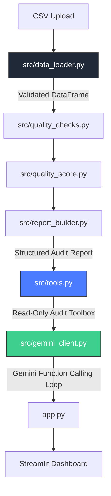
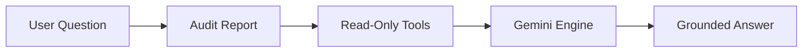

# 🤖 DataSentry AI — Gemini-Powered Data Quality Copilot

[](https://www.linkedin.com/in/wira-dhana-putra/)
[](https://medium.com/@wiradp)
[](https://wiradp.github.io/)

DataSentry AI is an AI-assisted data quality auditing application built with Streamlit, Python, and Google Gemini.

The project combines deterministic data quality analysis with a grounded AI copilot architecture. Instead of allowing the LLM to directly inspect uploaded datasets, DataSentry AI generates a structured audit report and exposes only read-only audit tools to Gemini. This design improves transparency, reduces hallucination risk, and ensures that factual answers remain traceable to deterministic audit results.

## 🌍 Live Demo

Try the deployed application here: [datasentry-ai.streamlit.app](https://datasentry-ai.streamlit.app)

---

# 📌 Project Overview

DataSentry AI helps analysts, data scientists, and business users quickly assess the quality of CSV datasets before using them for analytics, reporting, machine learning, or AI applications.

The application automatically evaluates dataset quality, identifies common issues, generates recommendations, and provides an AI copilot that can explain audit findings in natural language.

---

# 💼 Business Problem

Poor data quality is one of the most common causes of failed analytics and machine learning projects. 

Common systemic issues include:
* Missing values and high null-density
* Duplicate records undermining statistical power
* Extreme numerical outliers distorting models
* Inconsistent categorical variables
* Invalid data types causing structural computation failures
* Identifier leakage risking data privacy
* High-cardinality columns slowing inference
* Poor overall schema usability

Traditional data quality reviews are often manual, time-consuming, and difficult for non-technical stakeholders to interpret. DataSentry AI addresses this problem by combining deterministic quality auditing with explainable AI assistance.

---

# 🏗️ Solution Overview & Architecture

DataSentry AI performs two complementary, strictly isolated functions:

1. **Deterministic Audit Engine:** Calculates raw data quality metrics using Python backend data layers, generating a highly structured truth-report along with severity-aware scores.
2. **AI Copilot Architecture:** Leverages Google Gemini models to interface exclusively with the read-only JSON layout metadata—preventing raw cell mutation or arbitrary text fabrication.

### Data Flow Pipeline


### Core Execution Philosophy

> 💡 **Core Principle:** Python calculates facts. The audit report becomes the absolute source of truth. Gemini explains the facts through strictly scoped read-only tools.

---

# 🧠 Gemini Tool Architecture

A major design goal of DataSentry AI is reducing hallucination risk. Instead of handing the raw, unchecked DataFrame directly to an LLM loop, DataSentry acts as a deterministic guardrail:



### Available Architectural Tools (Read-Only):

* `get_dataset_overview` — Returns row/column schema, shape, and compression fingerprints.
* `get_quality_summary` — Extracts weighted overall degradation scores and thresholds.
* `get_missing_value_report` — Delivers pinpoint analysis on null aggregates.
* `get_duplicate_report` — Flags redundant record indexing.
* `get_column_quality_report` — Provides specific type metrics for target dimensions.
* `get_priority_issues` — Distills top-ranked alerts based on severity criteria.
* `get_ml_readiness_report` — Validates compliance for target model ingestion pipelines.

---

# 🚀 Main Features

### 📋 CSV Validation

* File extension, size, and multi-encoding detection
* Empty file and destructive null-byte pattern filtering
* Automatic structure parsing and delimiter identification
* Duplicate header validation and secure dataset fingerprinting

### 📊 Data Quality Analysis

* Dynamic dataset overview profiles
* Advanced missing value clustering and numeric outlier evaluations
* High-cardinality flags and potential accidental primary identifier tracking
* Category consistency profiling and implicit mismatched type warning logs

### 💯 Quality Scoring & Reporting

* Severity-aware structural penalty models and score band ranking
* Complete structured audit layout exportable to JSON layouts
* Prioritized actionable transformation recommendation checklists

---

# 🗂️ Folder Structure

```text
datasentry-ai/
├── app.py
├── README.md
├── requirements.txt
├── .env.example
├── .streamlit/
│   └── config.toml
├── src/
│   ├── config.py
│   ├── data_loader.py
│   ├── quality_checks.py
│   ├── quality_score.py
│   ├── report_builder.py
│   ├── prompts.py
│   ├── tools.py
│   ├── gemini_client.py
│   └── utils.py
├── tests/
├── data/
└── assets/

```

---

# ⚙️ Installation & Setup

Clone the repository:

```bash
git clone <repository-url>
cd datasentry-ai

```

Configure virtual environment isolation:

```bash
python -m venv .venv

# On Linux/macOS
source .venv/bin/activate

# On Windows
.venv\Scripts\activate

```

Install production engine dependencies:

```bash
python -m pip install --upgrade pip
python -m pip install -r requirements.txt

```

---

# 🌐 Environment Variables

Create a local runtime configurations file named `.env` in the root environment:

```env
GEMINI_API_KEY=your_api_key
GEMINI_MODEL=gemini-2.5-flash
GEMINI_TEMPERATURE=0.2
GEMINI_MAX_OUTPUT_TOKENS=2048
GEMINI_MAX_CONVERSATION_MESSAGES=12
GEMINI_MAX_TOOL_ROUNDS=5
GEMINI_REQUEST_TIMEOUT_SECONDS=60
DATASENTRY_DEFAULT_EXPLANATION_STYLE=business-friendly
DATASENTRY_DEFAULT_ANALYSIS_FOCUS=general-data-quality

```

> ⚠️ **Security Warning:** Never commit operational production `.env` credentials to version source control trackers.

---

# 🕹️ Running the Application

Launch the local Streamlit dashboard execution loop:

```bash
streamlit run app.py

```

Open your default web browser and access the interface at: `http://localhost:8501`

---

# 🧪 Testing Suite Validation

Execute the testing layout validations using `pytest`:

```bash
python -m pytest

```

Run comprehensive static runtime verification builds:

```bash
python -m pytest -q
python -m compileall app.py src tests
python -m pip check
git diff --check

```

---

# 📊 Sample Audit Results

When processing standard mock schemas (e.g., `data/sample_dirty_customers.csv`), the expected benchmark outputs are:

```text
Quality score        : 92.02
Score band           : READY_WITH_MINOR_REVIEW
Final readiness      : NEEDS_CLEANING

Total issues         : 27
CRITICAL             : 0
HIGH                 : 14
MEDIUM               : 7
LOW                  : 6

Duplicate rows       : 8
Duplicate percentage : 3.85%

```

*Note: A high baseline mathematical score does not override severe underlying structural issues; localized readiness gates can downgrade operational statuses accordingly.*

---

# 📸 UI Screenshots

### Dashboard Overview


### Quality Summary


### Issues Dashboard


### Recommendations Tab


### AI Copilot Interaction


---

# 🛑 Limitations & Disclaimers

### Technical Limitations

* Strictly optimized for flat CSV workloads (no native relational database connectivity)
* Stateless execution layout lacking explicit centralized authentication or persistent histories
* Scoring behaviors are heuristic models rather than definitive formal certifications

### Disclaimer

DataSentry AI is a portfolio and educational system. Heuristic quality indexing figures do not replace professional compliance architectures, enterprise-level risk assessments, or strict data governance standard workflows.

---

# 🔮 Future Roadmaps

* Integration for wider analytics structures (Parquet, Excel, Delta tables)
* Automated proactive cleaning routine scripts generation
* Tracking distribution drifts and validation monitoring timelines
* Persistent model memory, secure authentication middleware, and cloud multi-tenant execution

---

# 👤 Author

**[Wira Dhana Putra](https://wiradp.github.io/)**

* Career Switcher → Moving purposefully into Data Science, Machine Learning, and AI Engineering.
* Focus Pillars: Clean Data Architecture, Responsible AI Guardrails, and LLM Tool-Calling Implementations.

---